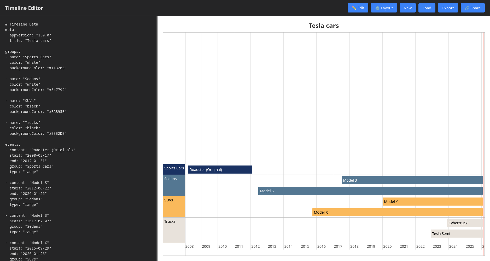

# Timeline Editor



An offline timeline visualization editor that uses YAML format for defining timeline events.

## YAML Data Format

The Timeline Editor uses a structured YAML format to define timeline events, metadata, and groupings.

## Features

- **Offline editing**: Works entirely in the browser with no server required
- **Auto-save**: Content is automatically saved to browser localStorage
- **Export**: Download timeline as YAML file
- **Import**: Load YAML files from disk
- **Share**: Generate shareable links with base64-encoded timeline data
- **Resizable editor**: Adjust editor/visualization split
- **Layout toggle**: Switch between horizontal and vertical layouts
- **Live preview**: Timeline updates as you type (with 500ms debounce)

### Basic Structure

```yaml
meta:
  appVersion: "1.0.0"
  title: "Timeline Title"

events:
  - content: "Event Name"
    start: "YYYY-MM-DD"
    end: "YYYY-MM-DD"      # optional
    group: "Group Name"     # optional
    type: "point"           # optional: "point", "range", or "background"

groups:                     # optional
  - name: "Group Name"
    color: "#color"
    backgroundColor: "#color"
```

You can use the description above as part of an AI prompt to generate a timeline for you.

### Field Descriptions

#### `meta` (optional)
Metadata about the timeline:
- **`appVersion`**: Application version (for compatibility tracking)
- **`title`**: Display title shown above the timeline visualization
- **`exportedAt`**: ISO timestamp (automatically added on export)

#### `events` (required)
Array of timeline events, each with:

| Field | Required | Description | Examples |
|-------|----------|-------------|----------|
| `content` | Yes | Event name/description | `"Initial Idea"`, `"Product Launch"` |
| `start` | Yes | Start date/time | `"2024-01-01"`, `"2024-01-01 14:30:00"` |
| `end` | No | End date/time (for ranges) | `"2024-02-15"`, `"2024-03-01 18:00:00"` |
| `type` | No | Event type | `"point"`, `"range"`, `"background"` |
| `group` | No | Group name for categorization | `"Development"`, `"Marketing"` |

**Event Types:**
- **`point`** (default): Single moment in time, displayed as a dot
- **`range`**: Time period with start and end dates, displayed as a bar
- **`background`**: Background shading for a time period

**Type Auto-Detection:**
- If `end` is specified without `type`, defaults to `"range"`
- If only `start` is specified, defaults to `"point"`
- If `type: "range"` but no `end` is provided, end defaults to today's date

#### `groups` (optional)
Define custom styling for event groups:

| Field | Required | Description | Example |
|-------|----------|-------------|---------|
| `name` | Yes | Group identifier (matches `event.group`) | `"Development"` |
| `color` | No | Text color | `"#ffffff"`, `"red"` |
| `backgroundColor` | No | Background color | `"#2196F3"`, `"rgba(0,128,0,0.5)"` |

**Default Group:**
If an event doesn't specify a group, it's assigned to the default group `"➡️"`.

---

## Examples

### Example 1: Simple Point Events

```yaml
meta:
  title: "Product Milestones"

events:
  - content: "Company Founded"
    start: "2020-01-15"
    type: "point"
    
  - content: "First Customer"
    start: "2020-03-22"
    
  - content: "Series A Funding"
    start: "2021-06-10"
```

### Example 2: Range Events (Project Timeline)

```yaml
meta:
  title: "Software Development Lifecycle"

events:
  - content: "Planning Phase"
    start: "2024-01-01"
    end: "2024-01-31"
    type: "range"
    
  - content: "Development"
    start: "2024-02-01"
    end: "2024-05-15"
    type: "range"
    
  - content: "Testing & QA"
    start: "2024-05-01"
    end: "2024-06-15"
    type: "range"
    
  - content: "Launch"
    start: "2024-06-20"
    type: "point"
```

### Example 3: Grouped Events with Custom Colors

```yaml
meta:
  title: "Multi-Team Project Timeline"

groups:
  - name: "Frontend"
    color: "#ffffff"
    backgroundColor: "#2196F3"
    
  - name: "Backend"
    color: "#ffffff"
    backgroundColor: "#4CAF50"
    
  - name: "DevOps"
    color: "#ffffff"
    backgroundColor: "#FF9800"

events:
  - content: "UI Design"
    start: "2024-01-05"
    end: "2024-01-25"
    group: "Frontend"
    
  - content: "Component Development"
    start: "2024-01-26"
    end: "2024-03-15"
    group: "Frontend"
    
  - content: "API Development"
    start: "2024-01-10"
    end: "2024-03-01"
    group: "Backend"
    
  - content: "Database Setup"
    start: "2024-01-05"
    end: "2024-01-20"
    group: "Backend"
    
  - content: "CI/CD Pipeline"
    start: "2024-02-01"
    end: "2024-02-15"
    group: "DevOps"
    
  - content: "Production Deployment"
    start: "2024-03-20"
    group: "DevOps"
    type: "point"
```

### Example 4: Mixed Event Types with Background

```yaml
meta:
  title: "Conference Planning"

events:
  - content: "Planning Period"
    start: "2024-01-01"
    end: "2024-03-01"
    type: "background"
    
  - content: "Call for Papers Opens"
    start: "2024-01-15"
    type: "point"
    
  - content: "Submission Deadline"
    start: "2024-02-28"
    type: "point"
    
  - content: "Review Period"
    start: "2024-03-01"
    end: "2024-04-01"
    type: "range"
    
  - content: "Notification Sent"
    start: "2024-04-05"
    type: "point"
    
  - content: "Conference Days"
    start: "2024-05-10"
    end: "2024-05-12"
    type: "range"
```

### Example 5: Personal Timeline

```yaml
meta:
  title: "My Career Journey"

groups:
  - name: "Work"
    backgroundColor: "#1976D2"
    color: "#ffffff"
    
  - name: "Education"
    backgroundColor: "#388E3C"
    color: "#ffffff"
    
  - name: "Personal"
    backgroundColor: "#7B1FA2"
    color: "#ffffff"

events:
  - content: "University Started"
    start: "2015-09-01"
    group: "Education"
    
  - content: "Bachelor's Degree"
    start: "2015-09-01"
    end: "2019-06-30"
    group: "Education"
    type: "range"
    
  - content: "Internship at TechCorp"
    start: "2018-06-01"
    end: "2018-08-31"
    group: "Work"
    
  - content: "Graduated"
    start: "2019-06-30"
    group: "Education"
    type: "point"
    
  - content: "Junior Developer"
    start: "2019-07-15"
    end: "2021-03-01"
    group: "Work"
    
  - content: "Got Married"
    start: "2020-08-15"
    group: "Personal"
    type: "point"
    
  - content: "Senior Developer"
    start: "2021-03-01"
    end: "2023-12-31"
    group: "Work"
    
  - content: "Tech Lead"
    start: "2024-01-01"
    group: "Work"
```

### Example 6: Legacy Format (Array)

For compatibility, the editor also supports a simpler array format without the `events` key:

```yaml
- content: "Event 1"
  start: "2024-01-01"
  
- content: "Event 2"
  start: "2024-01-15"
  end: "2024-02-01"
```

> **Note:** When exporting, this legacy format is automatically converted to the structured format with metadata.

---

## Date/Time Format

### Supported Formats

1. **Date only**: `"YYYY-MM-DD"` (e.g., `"2024-01-15"`)
2. **Date and time**: `"YYYY-MM-DD HH:mm:ss"` (e.g., `"2024-01-15 14:30:00"`)

### Examples

```yaml
events:
  # Date only
  - content: "All-day event"
    start: "2024-03-15"
    
  # With specific time
  - content: "Meeting at 2:30 PM"
    start: "2024-03-15 14:30:00"
    end: "2024-03-15 16:00:00"
    
  # Multi-day range
  - content: "Conference"
    start: "2024-05-10"
    end: "2024-05-12"
```

---


## Usage Tips

1. **Comments**: Use `#` for YAML comments to document your timeline
   ```yaml
   # This is a comment
   events:
     - content: "Event"  # Inline comment
       start: "2024-01-01"
   ```

2. **Multi-line content**: Use YAML multi-line syntax for long descriptions
   ```yaml
   events:
     - content: |
         This is a longer event description
         that spans multiple lines
       start: "2024-01-01"
   ```

3. **Color formats**: Groups support various CSS color formats:
   - Hex: `"#FF5733"`, `"#F57"`
   - RGB: `"rgb(255, 87, 51)"`
   - RGBA: `"rgba(255, 87, 51, 0.8)"`
   - Named: `"red"`, `"blue"`, `"green"`

4. **Error handling**: Invalid YAML or missing required fields will display an error message

---

## Browser Compatibility

Works in modern browsers that support:
- ES6+ JavaScript
- LocalStorage
- Clipboard API (for share link feature)
- FileReader API (for file import)

---

## License

See [LICENSE](LICENSE) file for details.
